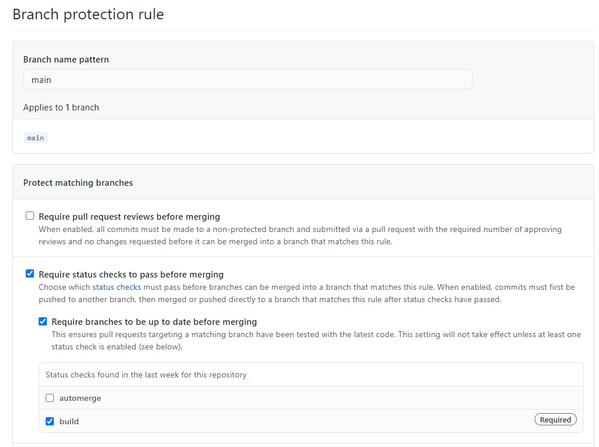

# merge-pr-example

This is a working example of how you could use [Size PRs](https://github.com/apps/size-prs).

## Scenario

You want to automatically merge pull requests that are classified as documentation.

### Warning

This auto-merge behaviour requires a high level of trust of people, processes and tools you have in place.

If configured incorrectly, this could result in code being released that is broken.

## Setup

1. Install the Size PRs application.
1. Create CI workflow.

    Typically, you will use tools for linting, compiling and testing your code.

    A fake example is in [.github/workflows/ci.yaml](.github/workflows/ci.yaml)

1. Add branch protection on your `main` branch.

    

1. Create [.github/workflows/automerge.yaml](.github/workflows/automerge.yaml) to automatically merge Pull Requests.

    This uses [Merge pull requests](https://github.com/marketplace/actions/merge-pull-requests).

This example merges Pull Requests labeled as `docs`, but you could change the conditions or use other labels for your workflow.

## Example Pull Request

[Pull Request #2](https://github.com/size-prs/merge-pr-example/pull/2) shows what happens when a PR is labelled with `kind/docs`.
